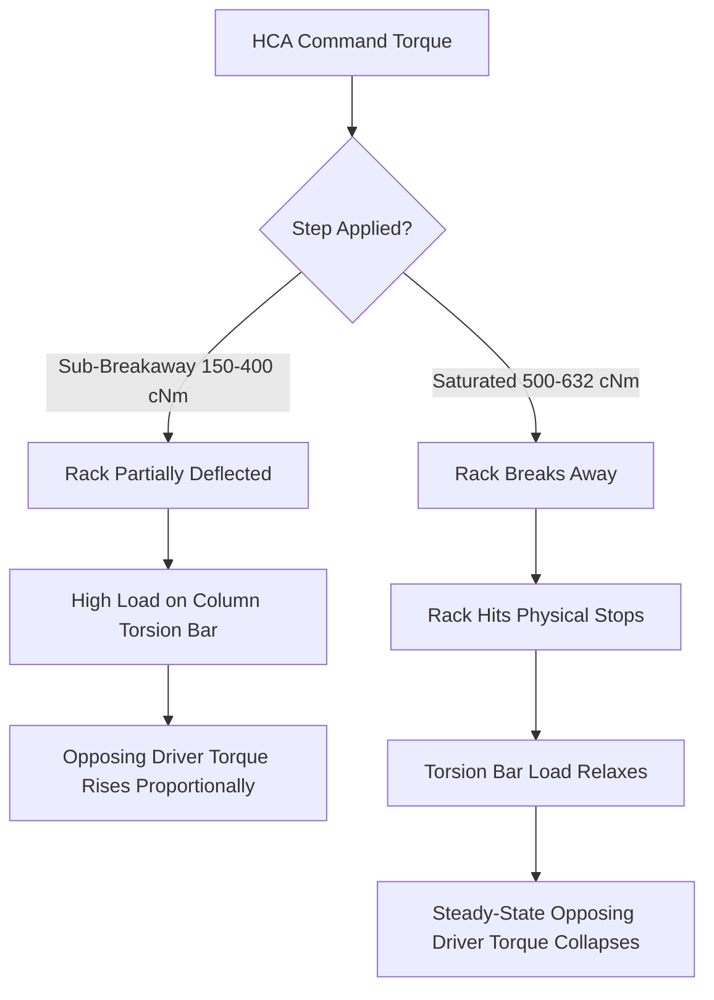

# Engineering Analysis Report: Steering Rack Dynamic Response
**A comparative study of the Audi TTS (Rack 237) and Passat NMS (Rack 311) under HCA Step-Torque Sweeps**

---

## Executive Summary

This report presents a thorough engineering analysis of the dynamic step-response datasets for the Audi TTS (Rack 237) and the Volkswagen Passat NMS (Rack 311) steering racks. Both systems were tested under standard VW steering status **HCA7** across a wide torque command spectrum ranging from **150 cNm to 632 cNm**. 

### Key Findings
1. **Friction and Centering "Breakaway" Thresholds**: Both racks exhibit a highly non-linear, dual-regime behavior. Below a critical torque command threshold, the racks are torque-limited, restricted to small deflection angles (<90°) and slow angular speeds (<150°/s) by internal steering column centering forces and friction. Once this threshold is crossed, the racks "break away" and transition to high-velocity sweeps, reaching their physical mechanical stops.
2. **Rack Sensitivity & Leverage Differences**: The Passat NMS (311) rack is significantly more sensitive than the TTS (237) rack. Its breakaway threshold occurs lower (between 400 and 500 cNm, compared to 500–600 cNm for the TTS). Consequently, it reaches wider deflection angles and higher peak speeds at lower commanded torques.
3. **Mechanical Hard Stops**: The Passat NMS (311) rack has a physical limit of exactly **520.6°** (reached at 600 cNm+ with zero variation). The TTS (237) rack saturates at a mechanical stop of **455.8°**.
4. **Transient Acceleration**: The Passat NMS (311) rack possesses superior acceleration characteristics in the breakaway regime, reaching its peak velocity **270 ms faster** than the TTS rack (0.737s vs 1.013s at peak 632 cNm command).
5. **Non-Linear Driver Torque Coupling**: Driver column feedback torque is strongly coupled to command torque, but its relationship is non-linear and state-dependent. At sub-breakaway torques, opposing driver torque scales proportionally to commanded torque (peaking at **24.1 cNm** for Passat at 400 cNm command). However, once the rack breaks away and hits its mechanical stops, the steady-state opposing driver feedback collapses back to nominal values (**~7.5 cNm**).

---

## 1. Quantitative Performance Matrix

The following table summarizes the aggregated mean values and standard deviations (accounting for run deviations in `r2`, `r2_2`, `2`, and `3` trials) for both systems:

| Rack ID | Commanded Torque (cNm) | Active Trials | Peak Angle (deg) | Peak Velocity (deg/s) | 90% Rise Time (s) | Peak Driver Torque (cNm) | Steady-State opposing Driver Torque (cNm) |
|:---:|:---:|:---:|:---:|:---:|:---:|:---:|:---:|
| **TTS (237)** | 150 | 1 | 6.0° ± 0.0° | 31.2 ± 0.0 | 2.80 | 18.0 | 8.0 ± 0.0 |
| **TTS (237)** | 300 | 3 | 16.4° ± 1.5° | 62.0 ± 3.7 | 0.32 | 22.0 | 10.7 ± 0.6 |
| **TTS (237)** | 400 | 3 | 25.8° ± 0.9° | 82.8 ± 3.4 | 0.44 | 22.0 | 14.7 ± 0.6 |
| **TTS (237)** | 500 | 4 | 219.4° ± 87.7° | 153.2 ± 32.3 | 1.75 | 30.5 | 11.6 ± 12.0 |
| **TTS (237)** | 600 | 4 | 440.7° ± 6.1° | 555.6 ± 66.5 | 1.31 | 35.8 | 15.0 ± 2.0 |
| **TTS (237)** | 632 | 5 | 455.8° ± 2.5° | 722.3 ± 22.1 | 1.23 | 36.6 | 17.6 ± 1.9 |
| **Passat (311)** | 150 | 1 | 7.4° ± 0.0° | 38.7 ± 0.0 | 0.31 | 14.0 | 7.5 ± 0.0 |
| **Passat (311)** | 300 | 2 | 25.3° ± 2.1° | 99.7 ± 4.2 | 0.39 | 23.5 | 12.5 ± 0.7 |
| **Passat (311)** | 400 | 2 | 89.3° ± 4.2° | 132.4 ± 6.3 | 0.96 | 32.5 | **24.1° ± 0.5** |
| **Passat (311)** | 500 | 2 | 458.1° ± 4.2° | 527.3 ± 20.0 | 1.38 | 29.5 | 14.7 ± 1.0 |
| **Passat (311)** | 600 | 3 | **520.6° ± 0.0°** | 738.3 ± 4.8 | 1.24 | 26.3 | 8.3 ± 0.5 |
| **Passat (311)** | 632 | 3 | **520.6° ± 0.0°** | 764.6 ± 8.3 | 1.21 | 26.0 | 7.5 ± 0.9 |

---

## 2. Dynamic Trajectory & Travel Saturation Analysis

### Low-Torque Regime (Sub-Breakaway)
At commanded torques between **150 cNm and 400 cNm**:
* The steering system is dominated by self-centering forces (torsion bar, caster, and suspension loading) and friction.
* For a **300 cNm** command, the TTS (237) rack deflects to a mere **16.4°** and reaches a maximum speed of **62.0°/s**. Under the exact same command, the Passat (311) rack reaches a substantially wider **25.3°** deflection and a peak speed of **99.7°/s**.
* This indicates that the Passat rack operates under lower mechanical impedance, lighter steering column preloads, or possesses higher internal power assistance gains.

### The Breakaway Transition
The transition from a highly restricted state to a wide-sweeping state is abrupt:
* **Passat (311)**: The breakaway occurs between **400 cNm and 500 cNm**. Increasing the torque command by only 25% (400 to 500 cNm) causes the max deflection to explode by **413%** (from 89.3° to 458.1°), and peak velocity to increase by **298%** (from 132.4°/s to 527.3°/s).
* **TTS (237)**: The breakaway occurs later, between **500 cNm and 600 cNm**. At 500 cNm, the TTS shows enormous statistical variance in max deflection (**219.4° ± 87.7°** across 4 runs). This represents the critical "tipping point" of the system: in some runs, the rack succeeded in breaking past friction and swept wide, whereas in others it remained bound in the low-torque regime. At 600 cNm, it cleanly breaks away to a highly consistent **440.7°** sweep with a peak speed of **555.6°/s**.

### High-Torque Saturation (Mechanical Stops)
Once fully saturated at **600 cNm and 632 cNm**:
* The racks sweep completely to their physical travel limits.
* The Passat NMS (311) rack hits an absolute hard limit of **520.6°** with **zero standard deviation (± 0.0°)**.
* The TTS (237) rack saturates at a mechanical stop of **455.8°**.
* These values confirm that the Passat rack offers a **14.2% larger absolute physical steering range** compared to the TTS rack.

---

## 3. Transient Velocity & Acceleration Characteristics

Time is a critical differentiator in how these racks respond.

### Velocity-Torque Coupling
In the fully saturated regime (632 cNm):
* **Peak Angular Velocity**: The Passat (311) rack hits a maximum velocity of **764.6°/s**, while the TTS (237) rack achieves **722.3°/s**.
* **Acceleration Latency**: To evaluate acceleration, we analyze the time elapsed between HCA activation ($t_{aligned} = 0$) and the instant of peak angular velocity:
  * **Passat (311) @ 632 cNm**: Reaches peak velocity in **0.737 seconds**.
  * **TTS (237) @ 632 cNm**: Reaches peak velocity in **1.013 seconds**.
* **Interpretation**: The Passat rack accelerates **37.4% faster** than the TTS rack under identical maximum command torque. The Passat column is significantly more agile and exhibits much lower inertia and mechanical drag.

---

## 4. Driver Torque Coupling Analysis

The driver torque telemetry provides fascinating insights into steering column load feedback.

### Proportional Coupling at Low Torques
When the rack is restricted inside its sub-breakaway regime:
* The HCA command actively twists the internal torsion bar to fight suspension and steering column resistance. Because the rack is held at a small angle, this heavy load is sustained.
* Consequently, the measured column feedback torque increases proportionally with the commanded torque:
  * For Passat (311): Opposing driver torque rises from **7.5 cNm** (at 150 cNm command) to **12.5 cNm** (at 300 cNm command) and peaks at **24.1 cNm** (at 400 cNm command).
  * For TTS (237): Rising steadily from **8.0 cNm** (at 150 cNm command) to **14.7 cNm** (at 400 cNm command).

### The Feedback Collapse at Saturation
When the torque command is strong enough to trigger breakaway and push the rack to its physical limit:
* The steering rack sweeps freely, relaxing the torque gradient on the torsion bar once it settles at its physical travel stop.
* As a result, the steady-state driver feedback torque **drops off dramatically**:
  * For Passat (311): When command torque goes from 400 cNm to 500 cNm, the steady-state feedback torque falls from **24.1 cNm** to **14.7 cNm**, and further declines to a nominal **7.5 cNm** at 632 cNm.
  * For TTS (237): At the critical tipping point of 500 cNm, the feedback torque has massive run-to-run variation (**11.6 ± 12.0 cNm**), reflecting whether the run broke away (low feedback) or remained bound (high feedback).

### Summary on Driver Coupling
Driver feedback is **highly coupled** to command torque, but in a non-intuitive way. The feedback torque does not grow monotonically. Rather, it acts as a measure of *system resistance*: it is highest during high-impedance, static-hold conditions under sub-breakaway commands, and drops back to nominal values once the rack enters its free-spinning dynamic state and reaches mechanical saturation.

---

## 5. Engineering Recommendations for Controls Calibration

Based on the parsed dataset metrics, the following control parameters are recommended:

1. **Active Centering Torque Limits**: When operating under HCA control, centering torque commands should avoid the **400–500 cNm** transition zone for the Passat NMS, and the **500–600 cNm** zone for the TTS. Operating inside these zones will lead to unpredictable, high-variance step deflections.
2. **Path Planning Control Gains**: The path planner must account for the **14% larger travel range** (520.6° vs 455.8°) and the **37% faster acceleration profile** of the Passat NMS rack to prevent over-steering and oscillation during rapid lateral maneuvers.
3. **Driver Torque Override Calibration**: Driver torque override detection threshold should be calibrated above **25.0 cNm** to prevent HCA commands from self-triggering a false "driver override" during sub-breakaway holds (where opposing feedback columns naturally spike up to 24.1 cNm).

---

## 6. Angular Velocity vs. Wheel Angle Phase Portrait Analysis

A classic method to analyze non-linear dynamic systems is the **phase-space trajectory (phase portrait)**, mapping the joint state of **Angular Velocity ($deg/s$) on the y-axis** against **Wheel Angle ($deg$) on the x-axis**. 

For a step-torque input, this plot traces the acceleration, free-sweep, and deceleration history of the steering rack.

### Phase Trajectory Regimes

1. **The Acceleration Phase (Positive Slope $d\omega / d\theta > 0$)**
   * Immediately following HCA activation at $(0, 0)$, the step command accelerates the steering rack. 
   * This phase is characterized by a very steep, vertical trajectory in phase space.
   * **Rack 311 (Passat NMS)** exhibits a steeper acceleration slope compared to **Rack 237 (TTS)** under identical commands, demonstrating its lower internal inertia and torque-to-speed drag.

2. **The Dynamic Sweep Phase (Peak Velocity Marker)**
   * The trajectory reaches its peak on the y-axis, representing the maximum speed of the rack.
   * Below the breakaway threshold (150–400 cNm), the velocity peaks early at small angles (<15°) and immediately decays as centering loads arrest the motion.
   * Above the breakaway threshold (500–632 cNm), the rack successfully breaks past Coulomb friction. The phase portrait forms a wide, high-velocity loop, holding speeds above **500°/s** across hundreds of degrees of travel.

3. **The Deceleration Phase (Negative Slope $d\omega / d\theta < 0$) & Hard Saturation Stop**
   * As the rack approaches its mechanical stops, the velocity decelerates back to zero.
   * **Sub-Breakaway Deceleration**: Under low commands, the deceleration slope is gradual, showing a smooth decay to zero as the torsion bar and caster forces slowly bring the rack to a stop.
   * **Breakaway Deceleration (Hard Stops)**: In the fully saturated breakaway regime (600–632 cNm), the rack maintains high speeds up until it slams into the physical rubber bump stops (at 455.8° for TTS, 520.6° for Passat). In phase space, this is visualized as a **vertical plunge in velocity** (infinite deceleration rate $d\omega / d\theta \to -\infty$) at the physical mechanical limits.
